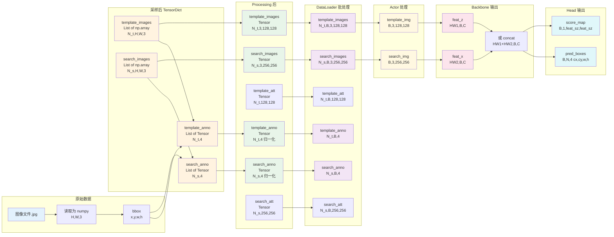
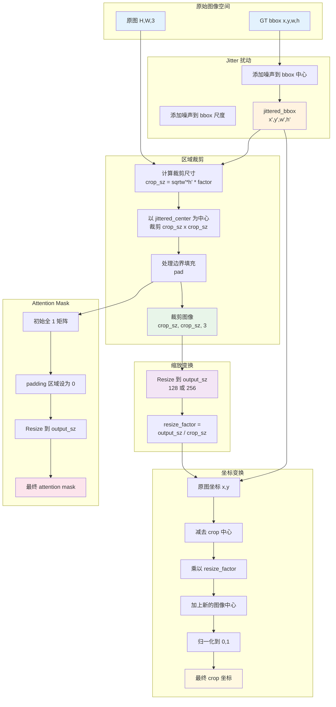
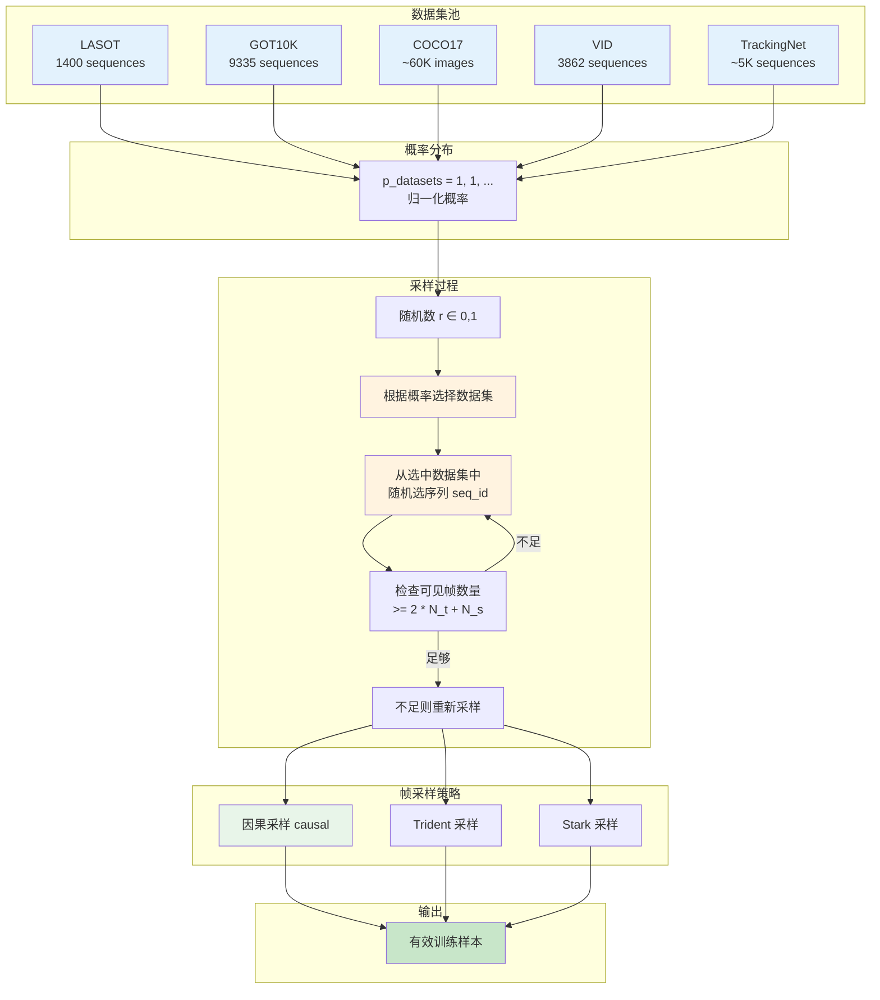
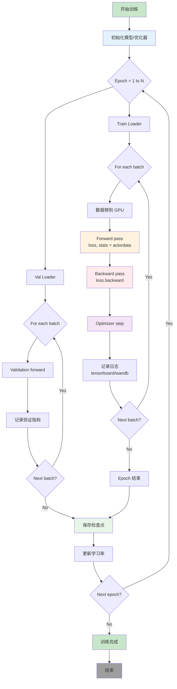

好的，我来为你整理成清晰的数据流图！

## 📊 OSTrack 官方数据流全景图

### **完整数据流程图**

```mermaid
graph TB
    subgraph "1️⃣ 配置阶段"
        A1[配置文件.yaml] --> A2[加载配置 cfg]
        A2 --> A3[初始化设置 settings]
    end
    
    subgraph "2️⃣ 数据集构建"
        B1[LASOT 数据集] --> B5[Dataset List]
        B2[GOT10K 数据集] --> B5
        B3[COCO 数据集] --> B5
        B4[VID 数据集] --> B5
        B5 --> B6[names2datasets]
    end
    
    subgraph "3️⃣ 数据采样 TrackingSampler"
        C1[随机选数据集] --> C2[采样序列 seq_id]
        C2 --> C3[采样基帧 base_frame]
        C3 --> C4[采样模板帧 template<br/>base-max_gap, base]
        C3 --> C5[采样搜索帧 search<br/>base, base+max_gap]
        C4 --> C6[获取图像+bbox<br/>dataset.get_frames]
        C5 --> C6
        C6 --> C7[TensorDict 封装]
    end
    
    subgraph "4️⃣ 数据处理 STARKProcessing"
        D1[联合变换<br/>灰度化 + 翻转] --> D2[Template 处理]
        D1 --> D3[Search 处理]
        
        D2 --> D2_1[Bbox Jitter]
        D2_1 --> D2_2[计算裁剪尺寸<br/>crop_sz = sqrt*w*h*factor]
        D2_2 --> D2_3[中心裁剪 crops]
        D2_3 --> D2_4[坐标变换到 crop]
        D2_4 --> D2_5[独立变换<br/>ToTensor+Normalize]
        
        D3 --> D3_1[Bbox Jitter]
        D3_1 --> D3_2[计算裁剪尺寸]
        D3_2 --> D3_3[中心裁剪 crops]
        D3_3 --> D3_4[坐标变换到 crop]
        D3_4 --> D3_5[独立变换]
        
        D2_5 --> D4[输出处理后的 TensorDict]
        D3_5 --> D4
    end
    
    subgraph "5️⃣ DataLoader 批处理"
        E1[收集 batch 个样本] --> E2[ltr_collate_stack1]
        E2 --> E3[沿 dim=1 堆叠]
        E3 --> E4[Batch 数据]
    end
    
    subgraph "6️⃣ 模型前向传播"
        F1[template_images<br/>N_t,B,3,128,128] --> F3[View 重塑<br/>B,3,128,128]
        F2[search_images<br/>N_s,B,3,256,256] --> F4[View 重塑<br/>B,3,256,256]
        F3 --> F5[ViT Backbone]
        F4 --> F5
        F5 --> F6[特征图<br/>HW2,B,C]
        F6 --> F7[Box Head]
        F7 --> F8[pred_boxes<br/>B,N,4]
        F7 --> F9[score_map<br/>B,1,H,W]
    end
    
    subgraph "7️⃣ 损失计算"
        G1[pred_boxes] --> G3[坐标转换<br/>cxcywh→xyxy]
        G2[gt search_anno] --> G4[坐标转换<br/>xywh→xyxy]
        G3 --> G5[GIoU Loss]
        G4 --> G5
        G3 --> G6[L1 Loss]
        G4 --> G6
        G2 --> G7[生成高斯热图]
        G9[score_map] --> G8[Focal Loss]
        G7 --> G8
        G5 --> G10[加权求和]
        G6 --> G10
        G8 --> G10
        G10 --> G11[Total Loss]
    end
    
    subgraph "8️⃣ 反向传播优化"
        H1[Loss.backward] --> H2[梯度计算]
        H2 --> H3[Optimizer.step]
        H3 --> H4[更新权重]
    end
    
    A3 --> C1
    B6 --> C1
    C7 --> D1
    D4 --> E1
    E4 --> F1
    E4 --> F2
    F8 --> G1
    F9 --> G9
    G11 --> H1
    
    style A1 fill:#e3f2fd
    style B1 fill:#fff3e0
    style B2 fill:#fff3e0
    style B3 fill:#fff3e0
    style B4 fill:#fff3e0
    style C1 fill:#f3e5f5
    style C2 fill:#f3e5f5
    style C3 fill:#f3e5f5
    style D1 fill:#e8f5e9
    style D2 fill:#e8f5e9
    style D3 fill:#e8f5e9
    style E1 fill:#ffebee
    style F1 fill:#fff8e1
    style F2 fill:#fff8e1
    style F5 fill:#fff8e1
    style G1 fill:#fce4ec
    style G2 fill:#fce4ec
    style H1 fill:#e0f7fa
```

---

## 📐 **数据形状变化详解图**

---

## 🔄 **时空变换流程图**

---

## 🎯 **多数据集混合采样流程图**

---

## ⚙️ **训练迭代流程图**

---

## 📦 **关键数据结构对照表**

| 阶段 | 字段名 | 形状 | 数据类型 | 说明 |
|------|--------|------|----------|------|
| **采样后** | `template_images` | `[N_t, H, W, 3]` | List[np.array] | 原始模板图像列表 |
| | `template_anno` | `[N_t, 4]` | List[Tensor] | (x,y,w,h) 原始坐标 |
| | `search_images` | `[N_s, H, W, 3]` | List[np.array] | 原始搜索图像列表 |
| | `search_anno` | `[N_s, 4]` | List[Tensor] | (x,y,w,h) 原始坐标 |
| **Processing 后** | `template_images` | `[N_t, 3, 128, 128]` | Tensor | 归一化模板图像 |
| | `template_anno` | `[N_t, 4]` | Tensor | 归一化到 [0,1] |
| | `template_att` | `[N_t, 128, 128]` | Tensor | attention mask |
| | `search_images` | `[N_s, 3, 256, 256]` | Tensor | 归一化搜索图像 |
| | `search_anno` | `[N_s, 4]` | Tensor | 归一化到 [0,1] |
| **DataLoader 后** | `template_images` | `[N_t, B, 3, 128, 128]` | Tensor | 批处理模板 |
| | `search_images` | `[N_s, B, 3, 256, 256]` | Tensor | 批处理搜索 |
| | `template_anno` | `[N_t, B, 4]` | Tensor | 批处理标注 |
| | `search_anno` | `[N_s, B, 4]` | Tensor | 批处理标注 |
| **Actor 输入** | `template_img` | `[B, 3, 128, 128]` | Tensor | 单张模板 |
| | `search_img` | `[B, 3, 256, 256]` | Tensor | 单张搜索 |
| **Backbone 输出** | `feat_x` | `[HW2, B, C]` | Tensor | 搜索区特征 |
| **Head 输出** | `pred_boxes` | `[B, N, 4]` | Tensor | 预测框 cx,cy,w,h |
| | `score_map` | `[B, 1, feat_sz, feat_sz]` | Tensor | 置信度热图 |

---

## 📝 **形状列参数注释**

- `N_t`：模板帧数量（num_template_frames），本项目通常为 1。
- `N_s`：搜索帧数量（num_search_frames），本项目通常为 1。
- `B`：batch size（每个迭代的样本数）。
- `H, W`：原始图像高和宽（采样后、处理前，来自原始数据分辨率）。
- `3`：图像通道数（RGB 三通道）。
- `128`：模板分支裁剪并缩放后的空间尺寸，即 `template_size=128`。
- `256`：搜索分支裁剪并缩放后的空间尺寸，即 `search_size=256`。
- `4`：边框参数维度，格式为 `(x, y, w, h)`；在 `pred_boxes` 中语义为 `(cx, cy, w, h)`。
- `C`：backbone 输出特征通道数（由模型结构决定）。
- `HW2`：搜索分支特征图展平后的 token 数，等于 `H_feat * W_feat`。
- `N`：head 输出的查询数或候选框数（由 head 设计决定）。
- `1`：`score_map` 的通道数（单通道目标置信度图）。
- `feat_sz`：分类/定位分支特征图边长，通常与搜索尺寸和 backbone stride 相关。

说明：由于你当前使用官方 256 设置，搜索相关张量统一采用 `256 x 256`，而不是 `320 x 320`。

---

这些流程图展示了 OSTrack 从数据准备到模型训练的完整数据流转过程。每个阶段都有明确的数据形状变换和处理逻辑，形成了一个高效的端到端训练流水线！