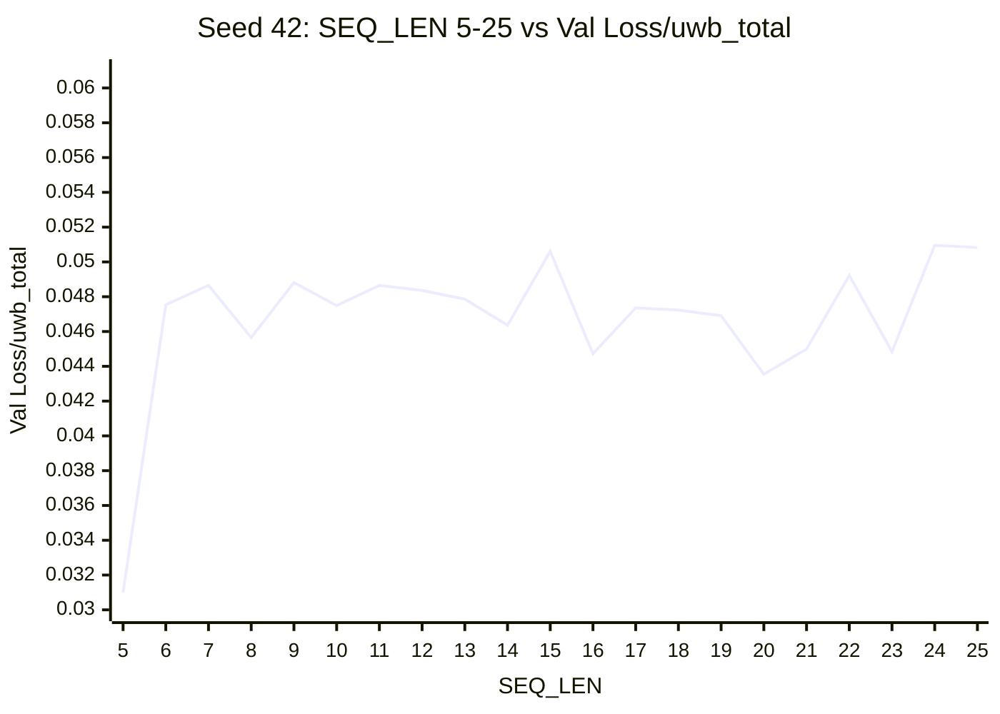
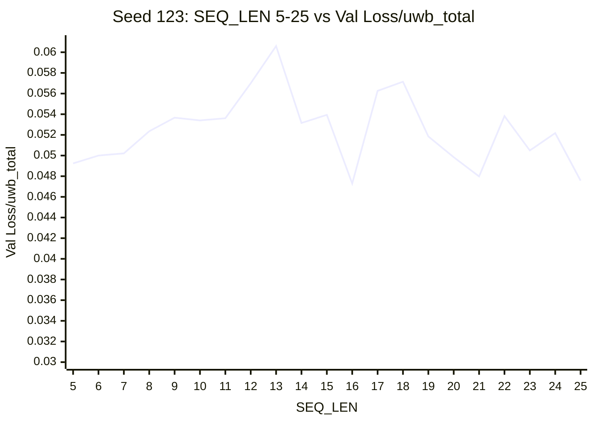
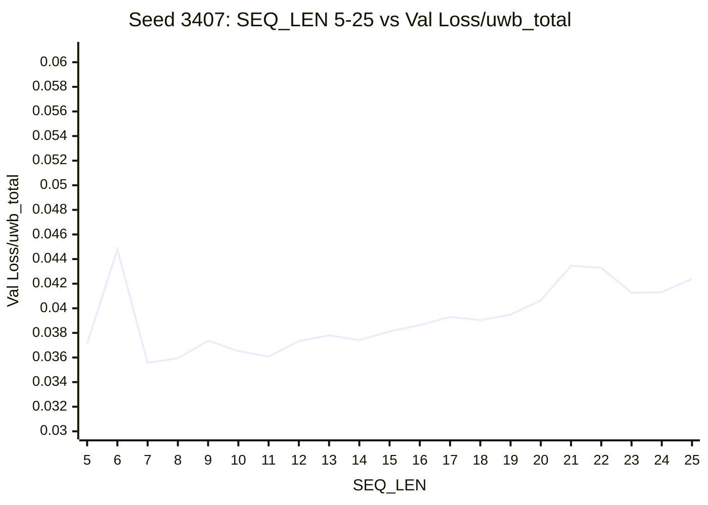
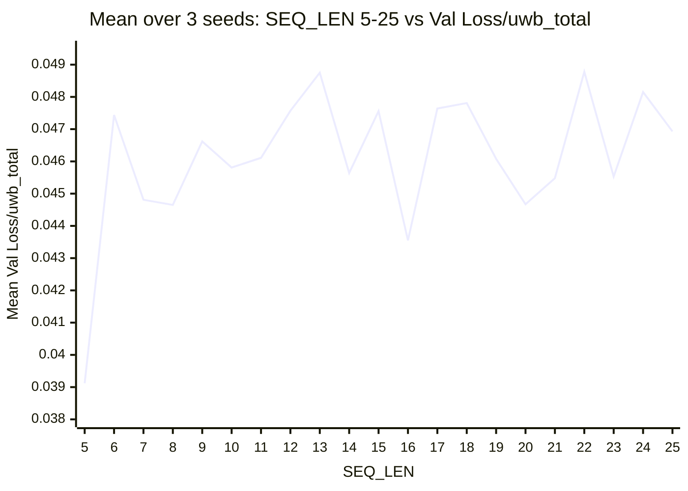
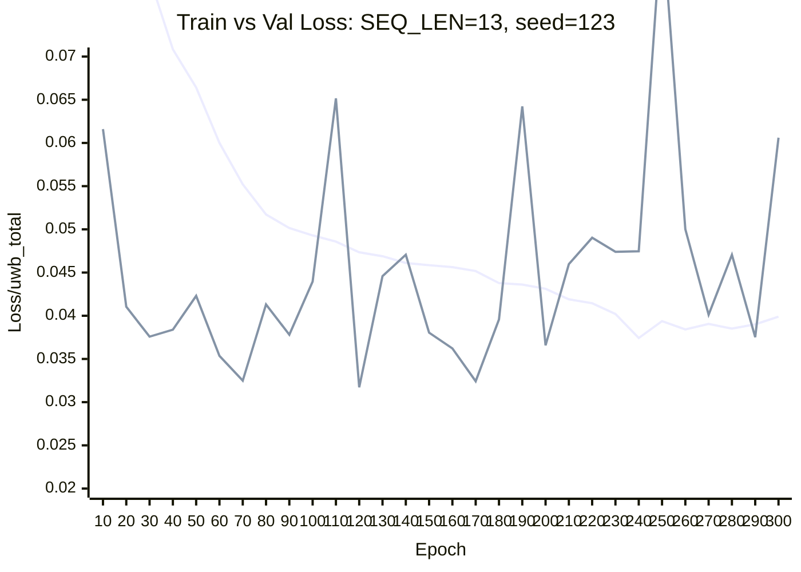
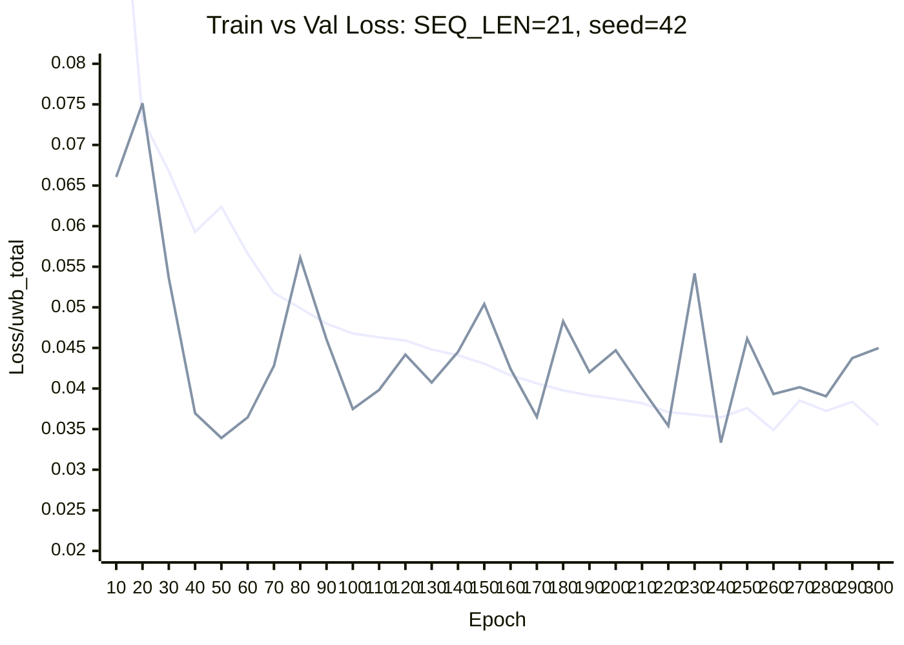
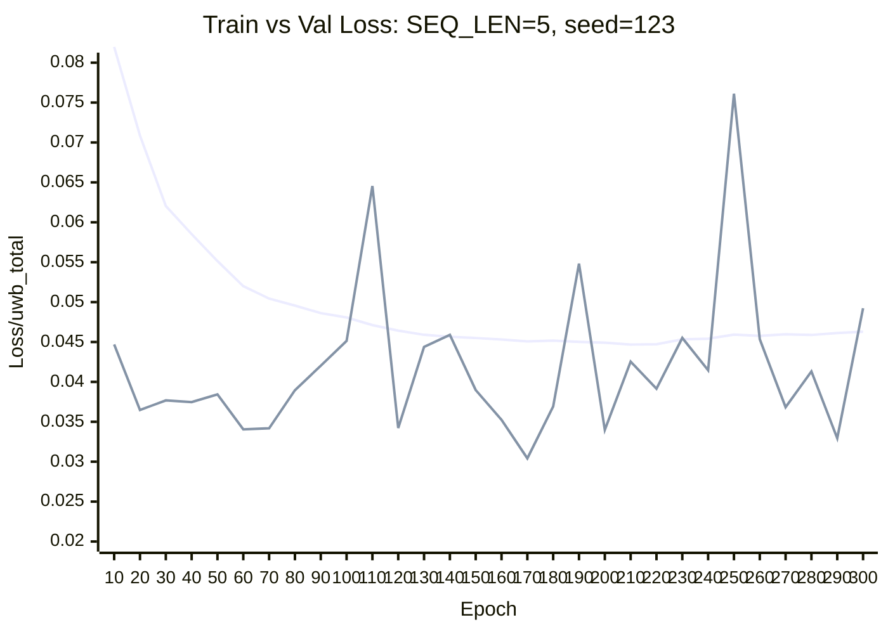

# UGTrack Stage-1 中 UWB `SEQ_LEN` 的 Conv1D 消融实验

## 1. 实验目的

本轮实验在修正后的 Stage-1 UWB-only 轻量数据流上，进一步扩大 `SEQ_LEN` 搜索范围，并显著增加训练轮数，以重新评估时序窗口长度对 UWB 分支性能的影响。相较于前一轮仅在 `5~15` 区间、`epoch=100` 上进行的多种子复核，本轮实验重点回答以下问题：

1. 当训练轮数增加到 `300`，且搜索区间扩展到 `5~25` 后，最优 `SEQ_LEN` 是否发生迁移。
2. 在更长训练周期下，性能最优与稳定性最优是否仍然一致。
3. 从 train/val 曲线看，是否已经出现过拟合，以及合理的最佳训练 epoch 应位于何处。

## 2. 实验设置

### 2.1 模型与任务

- 任务：UGTrack Stage-1，仅训练 UWB 分支
- 数据集：`OTB100_UWB`
- UWB encoder：`conv1d`
- 输出激活：`sigmoid`

### 2.2 训练配置

除 `SEQ_LEN` 外，其余关键配置保持一致：

- `TRAIN.EPOCH = 300`
- `TRAIN.LR_DROP_EPOCH = 120`
- `TRAIN.BATCH_SIZE = 80`
- `TRAIN.NUM_WORKER = 0`
- `TRAIN.VAL_EPOCH_INTERVAL = 10`
- `TRAIN.LR = 4e-4`
- `TRAIN.WEIGHT_DECAY = 1e-4`
- `TRAIN.OPTIMIZER = ADAMW`

### 2.3 数据流与实验协议

本轮实验继续采用当前版本的 Stage-1 UWB-only 数据路径：

- `train split` 与 `val split` 明确分离；
- `OTB100UWB.get_sequence_info()` 已加入按序列惰性缓存；
- Stage-1 不再经过图像裁剪和 tracking 风格数据处理链路；
- 每个 `SEQ_LEN` 使用 3 个随机种子重复实验：`42 / 123 / 3407`。

因此，本轮结果主要反映 UWB 分支自身对时序窗口长度的响应，而不受图像处理链路干扰。

## 3. 评价指标

以 `epoch 300` 的验证集结果作为最终比较依据，记录以下指标：

- `Loss/uwb_total`
- `Loss/uwb_pred`
- `Loss/uwb_alpha`

其中：

```text
Loss/uwb_total = 50 * Loss/uwb_pred + 5 * Loss/uwb_alpha
```

本文主排序指标仍为 `uwb_total`，并结合 `uwb_pred` 与 `uwb_alpha` 对结果进行解释。

## 4. 实验结果

### 4.1 Epoch 300 的最终结果表

表 1 按 `SEQ_LEN = 5~25` 的数字顺序给出 3 个随机种子的最终验证结果，以及均值和标准差。该表不按性能重新排序，便于直接对应后续图表观察趋势。

| SEQ_LEN | Seed42 `uwb_total` | Seed123 `uwb_total` | Seed3407 `uwb_total` | Mean `uwb_total` | Std | Mean `uwb_pred` | Mean `uwb_alpha` |
|---:|---:|---:|---:|---:|---:|---:|---:|
| 5  | 0.03100 | 0.04924 | 0.03713 | 0.03912 | 0.00928 | 0.00009 | 0.00694 |
| 6  | 0.04754 | 0.05000 | 0.04479 | 0.04744 | 0.00261 | 0.00015 | 0.00797 |
| 7  | 0.04865 | 0.05021 | 0.03557 | 0.04481 | 0.00804 | 0.00009 | 0.00805 |
| 8  | 0.04565 | 0.05235 | 0.03594 | 0.04465 | 0.00825 | 0.00009 | 0.00800 |
| 9  | 0.04881 | 0.05367 | 0.03737 | 0.04662 | 0.00837 | 0.00010 | 0.00832 |
| 10 | 0.04749 | 0.05340 | 0.03653 | 0.04581 | 0.00856 | 0.00009 | 0.00825 |
| 11 | 0.04865 | 0.05361 | 0.03607 | 0.04611 | 0.00904 | 0.00009 | 0.00829 |
| 12 | 0.04836 | 0.05700 | 0.03734 | 0.04757 | 0.00985 | 0.00009 | 0.00856 |
| 13 | 0.04786 | 0.06060 | 0.03780 | 0.04875 | 0.01143 | 0.00012 | 0.00851 |
| 14 | 0.04636 | 0.05315 | 0.03741 | 0.04564 | 0.00789 | 0.00009 | 0.00819 |
| 15 | 0.05061 | 0.05394 | 0.03812 | 0.04756 | 0.00834 | 0.00009 | 0.00859 |
| 16 | 0.04472 | 0.04729 | 0.03863 | 0.04355 | 0.00445 | 0.00010 | 0.00773 |
| 17 | 0.04736 | 0.05626 | 0.03930 | 0.04764 | 0.00848 | 0.00010 | 0.00855 |
| 18 | 0.04723 | 0.05715 | 0.03904 | 0.04781 | 0.00907 | 0.00010 | 0.00856 |
| 19 | 0.04691 | 0.05185 | 0.03949 | 0.04608 | 0.00622 | 0.00011 | 0.00817 |
| 20 | 0.04354 | 0.04984 | 0.04064 | 0.04467 | 0.00470 | 0.00010 | 0.00795 |
| 21 | 0.04499 | 0.04798 | 0.04347 | 0.04548 | 0.00229 | 0.00010 | 0.00810 |
| 22 | 0.04922 | 0.05382 | 0.04329 | 0.04878 | 0.00528 | 0.00010 | 0.00876 |
| 23 | 0.04484 | 0.05049 | 0.04126 | 0.04553 | 0.00465 | 0.00009 | 0.00816 |
| 24 | 0.05096 | 0.05217 | 0.04131 | 0.04815 | 0.00595 | 0.00009 | 0.00868 |
| 25 | 0.05083 | 0.04757 | 0.04239 | 0.04693 | 0.00426 | 0.00009 | 0.00843 |

### 4.2 三个随机种子的曲线图

#### Seed 42



#### Seed 123



#### Seed 3407



### 4.3 综合平均曲线



## 5. 结果分析

### 5.1 主要现象

从表格与 4 张图可以直接观察到三个事实：

1. 三个随机种子的曲线形状差异较大，说明 `SEQ_LEN` 对当前 Stage-1 任务的影响存在明显随机性依赖。
2. 综合平均曲线不再表现为单调趋势，也未出现一个尖锐、稳定的唯一最优点，而是出现多个局部低谷。
3. 在 `epoch=300` 的设置下，均值最优点回到了较短窗口 `SEQ_LEN=5`，但其方差显著偏大，因此不能简单地将其解释为“可靠最优”。

### 5.2 平均性能最优与稳定性最优发生分离

从均值看：

- `SEQ_LEN = 5` 的 `Mean Loss/uwb_total = 0.03912`，为全表最低。

但从标准差看：

- `SEQ_LEN = 5` 的 `Std = 0.00928`，波动非常大；
- `SEQ_LEN = 21` 的 `Std = 0.00229`，为全表最小。

这说明在更长训练周期和更大搜索区间下，平均性能最优与跨种子稳定性最优已经明显分离。

### 5.3 不再支持“窗口越大越好”或“中间固定最优”的简单结论

若仅看均值，前几名主要分布在以下位置：

- `5`: `0.03912`
- `16`: `0.04355`
- `8`: `0.04465`
- `20`: `0.04467`
- `7`: `0.04481`

这些点并不集中在单一连续区间，而是分散在短、中、偏长窗口中。这表明：

1. 当训练轮数增加至 `300` 后，原先在 `epoch=100`、`SEQ_LEN=5~15` 条件下观察到的局部最优区间，并未稳定保持。
2. 当前 Stage-1 指标对随机种子较为敏感，单纯通过扩大 `SEQ_LEN` 搜索范围并不能稳定收敛到单一结论。

### 5.4 `seed_123` 明显更难训练

三条单独曲线显示，`seed_123` 在多数 `SEQ_LEN` 下的验证损失均高于另外两个种子，且在 `SEQ_LEN=13` 附近出现最明显峰值。相比之下：

- `seed_42` 在 `SEQ_LEN=5` 处取得全局最低单次结果 `0.03100`
- `seed_3407` 在 `SEQ_LEN=7~15` 区间整体较低且更平滑

这说明当前实验系统对初始化或数据采样随机性的敏感性仍然较高，结论必须依赖多种子统计，而不能只参考单次训练结果。

## 6. 最佳 Epoch 与过拟合分析

### 6.1 分析方法

为避免仅依据 `epoch 300` 的最终结果做结论，本文进一步对每个 `SEQ_LEN × seed` 的 train/val 曲线进行分析：

1. 从日志中提取每个 epoch 末尾的 `train Loss/uwb_total`；
2. 提取每个验证点的 `val Loss/uwb_total`；
3. 对每个实验寻找 **验证集损失最低** 的 epoch，记为最佳验证 epoch；
4. 比较最佳验证 epoch 与 `epoch 300` 的验证损失差异，以判断是否存在过拟合。

### 6.2 总体统计

对全部 `21 × 3 = 63` 个实验统计得到：

- 最佳验证 epoch 的平均值：`158.73`
- 最佳验证 epoch 的中位数：`170`
- 出现频次最多的最佳验证 epoch：`170`（22 次）

最佳验证 epoch 的分布如下：

- `170`: 22 次
- `50`: 12 次
- `240`: 11 次
- `250`: 6 次
- `90`: 6 次
- `220`: 2 次
- `130`: 1 次
- `120`: 1 次
- `210`: 1 次
- `80`: 1 次

这说明对于当前实验体系，如果必须选择一个统一的早停轮次，`epoch 170` 是最合理的默认候选。

### 6.3 过拟合程度

将每个实验在最佳验证 epoch 的 `val Loss/uwb_total` 与 `epoch 300` 的最终验证损失比较，可得到：

- 平均恶化幅度：`0.01423`
- 中位数恶化幅度：`0.01499`
- `63` 个实验中，有 `43` 个在最后比最佳点差 `0.01` 以上
- `63` 个实验中，有 `31` 个在最后比最佳点差 `0.015` 以上

最严重的实验为：

- `SEQ_LEN = 13`, `seed = 123`
- 最佳验证 epoch：`120`
- 最佳验证损失：`0.03172`
- `epoch 300` 验证损失：`0.06060`
- 恶化幅度：`0.02888`

这一差距已经不能视为轻微波动，而是明显过拟合。

### 6.4 典型现象

从曲线特征看，当前实验大多呈现出一致模式：

- train loss 在后期继续下降或维持在较低水平；
- val loss 在较早时期达到最低点后，随着训练继续反而上升；
- 因此 `epoch 300` 往往不能代表最优泛化性能。

为更直观地展示过拟合现象，图 5-7 给出三个代表性实验的 train/val loss 坐标图。

#### 图 5. `SEQ_LEN = 13`, `seed = 123`

该实验是本轮中过拟合最明显的样本之一。验证集在 `epoch 120` 达到最低 `0.03172`，随后明显反弹，到 `epoch 300` 恶化为 `0.06060`，而 train loss 仍处于低位。



#### 图 6. `SEQ_LEN = 21`, `seed = 42`

该实验比图 5 更平滑，但趋势相同。验证集在 `epoch 240` 达到最低 `0.03334`，之后回升到 `epoch 300` 的 `0.04499`；与此同时，train loss 仍维持下降或低位波动。



#### 图 7. `SEQ_LEN = 5`, `seed = 123`

该实验说明即使某些配置在最终平均结果上表现较好，也不能直接依赖最后一轮。该实验在 `epoch 170` 达到最佳 `0.03042`，之后验证损失再次抬升，到 `epoch 300` 为 `0.04924`。



例如 `SEQ_LEN = 21`, `seed = 42`：

- 最佳验证 epoch 为 `240`
- 最佳验证损失为 `0.03334`
- 到 `epoch 300` 时，验证损失回升到 `0.04499`

这是一种典型的后期过拟合现象。

### 6.5 对实验结论的影响

因此，`epoch 300` 的最终表格更适合用于展示“在固定训练轮次下”的结果，而不适合作为最终最优配置判断的唯一依据。对于后续论文或方法比较，更合理的做法应为：

1. 以 **best val checkpoint** 作为主结果；
2. 将 `epoch 300` 结果作为补充分析；
3. 在需要统一轮次时，可优先采用 `epoch 170` 作为默认早停点。

## 7. 审稿人视角的讨论

从审稿人视角看，本轮实验的价值在于它揭示了一个比“找到单一最优 `SEQ_LEN`”更重要的问题：**在更长训练周期下，Stage-1 UWB 分支对 `SEQ_LEN` 的最优选择并不稳定，且固定使用最后一轮结果会放大过拟合影响。**

这一现象意味着：

1. `SEQ_LEN` 对当前 Stage-1 指标确实敏感，但敏感方向受随机种子影响明显；
2. `epoch=100` 时观察到的局部最优区间不一定在 `epoch=300` 时仍然成立；
3. 仅凭 `epoch 300` 的 Stage-1 `uwb_total` 难以支撑最终“最佳 `SEQ_LEN`”的强结论；
4. 后续比较应优先基于 best val checkpoint，并进一步引入 Stage-2 或最终 tracking 指标验证。

## 8. 当前结论

基于 `SEQ_LEN = 5~25`、`epoch = 300`、3 个随机种子的 Stage-1 UWB-only 实验，可以得到以下结论：

1. 按 `epoch 300` 的最终均值看，`SEQ_LEN = 5` 当前最低，但其波动过大，不能视为稳健最优。
2. 按 `epoch 300` 的稳定性看，`SEQ_LEN = 21` 的标准差最小，是当前最稳的候选配置。
3. 从 train/val 曲线看，大多数实验在 `epoch 300` 前已经出现明显过拟合。
4. 全部实验的最佳验证 epoch 中位数为 `170`，因此 `170` 是当前最合理的统一早停候选。
5. 当前实验更适合作为“缩小 Stage-2 候选集合”的依据，而不宜直接将 `epoch 300` 最终结果作为最终最优配置结论。

## 9. 后续建议

基于当前结果，下一步不建议继续单纯扩大 `SEQ_LEN` 搜索区间，而应转向以下更有价值的验证：

1. 将 `SEQ_LEN = 5 / 16 / 21` 带入 Stage-2 或最终 tracking benchmark，对比 Success / Precision。
2. 若继续在 Stage-1 内部比较，主结果应改为使用 **best val checkpoint**。
3. 若实验流程必须固定统一轮次，优先考虑将默认训练轮次或早停轮次设为 `170`，而不是 `300`。

## 10. 结论摘要

在将 `SEQ_LEN` 搜索区间扩展到 `5~25` 并把训练轮数增加到 `300` 后，UGTrack Stage-1 中 Conv1D UWB 分支的表现不再支持一个简单、稳定的单点最优结论。尽管 `SEQ_LEN = 5` 在 `epoch 300` 的均值上取得最低验证损失，但其跨种子波动很大；相反，`SEQ_LEN = 21` 在稳定性上最优。更重要的是，绝大多数实验在训练后期已经出现明显过拟合，最佳验证 epoch 的中位数为 `170`。因此，当前更严谨的结论应是：Stage-1 结果应优先基于 best val checkpoint 或统一早停轮次进行比较，而真正有价值的 `SEQ_LEN` 配置仍需通过 Stage-2 或最终 tracking 指标来确认。
